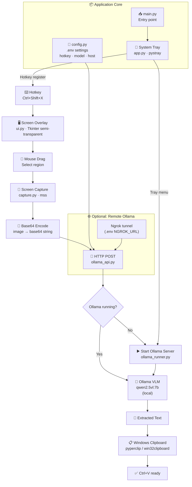

# 👁️ CopyTool AI (Local OCR)

> A Windows application that lives in your system tray, allowing you to select any area of your screen and extract text using a local **Ollama** VL model. Extracted text is instantly copied to your clipboard.


---

## 🏗️ Architecture



---

## ✨ Features

- **Local Processing**: Keeps your data private by using an Ollama server running on your PC (e.g. `qwen2.5vl:7b`).
- **Unified System Tray**: One tray icon manages everything — taking screenshots, starting the Ollama server, and toggling the console.
- **Fast Hotkeys**: Press `Ctrl+Shift+X` (configurable) at any time to draw a selection box on your screen.
- **Auto-Clipboard**: Once the OCR is done, the text is immediately available to paste (`Ctrl+V`).
- **Ngrok Support (Optional)**: Can be configured via `.env` to route traffic through Ngrok if your Ollama instance is on another machine.

---

## 🚀 Setup & Installation

### 1. Requirements
- Windows OS
- Python 3.9+
- [Ollama](https://ollama.com/) installed
- Vision model pulled: `ollama pull qwen2.5vl:7b`

### 2. Install Dependencies

```bash
git clone https://github.com/Totsamuychel/CopyTool-App-with-AI.git
cd CopyTool-App-with-AI

python -m venv venv
# Activate virtual environment
venv\\Scripts\\activate

pip install -r requirements.txt
```

### 3. Configuration
Copy the configuration template:
```bash
cp .env.example .env
```
Edit `.env` to change your hotkey or model if you want. **By default, it uses localhost** (no ngrok required).

### 4. Run the Application
```bash
python main.py
```

---

## 📂 Project Structure

```text
CopyTool-App-with-AI/
├── main.py                  ← Entry point
├── requirements.txt         ← Dependencies
├── .env.example             ← Settings template
├── icon.png                 ← Tray icon
└── copytool/
    ├── config.py            ← Environment and constants
    ├── app.py               ← Tray icon, hotkey registration
    ├── ui.py                ← Tkinter screen selection overlay
    ├── capture.py           ← Screen capture (mss) and base64 encoding
    ├── ollama_api.py        ← HTTP requests to Ollama
    └── ollama_runner.py     ← Logic to start Ollama server locally
```

---

## ⚙️ How It Works

1. The app starts and sits quietly in the **System Tray**.
2. Pressing `Ctrl+Shift+X` opens a semi-transparent black overlay.
3. You drag your mouse to **select an area**.
4. The app captures that specific region as an image.
5. The image is converted to `base64` and sent via HTTP POST to your local **Ollama** server.
6. The VLM model (Vision Language Model) extracts the text.
7. The extracted text is put into your **Windows Clipboard**.

---

## 💡 Troubleshooting
- **Cannot get console handle:** Run the script from a standard Command Prompt or PowerShell, not a background GUI runner.
- **Ollama connection error:** Make sure Ollama is running. You can right-click the tray icon and select "Start Ollama Server".
- **Hotkey already in use:** Change the `HOTKEY` variable in the `.env` file.
